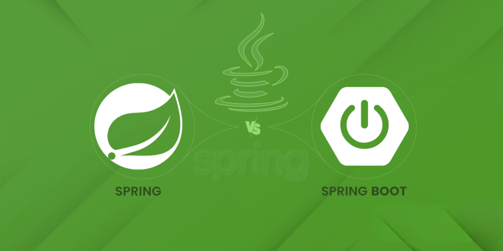
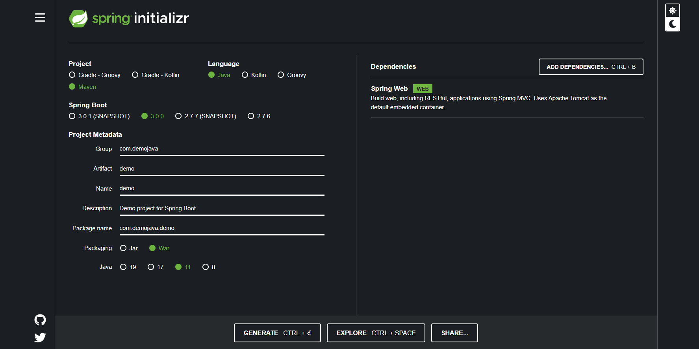

<h2 align="center">  Java | Learning SpringBoot 🍃 </h2>
<!-- https://shields.io/ -->

<p align="center">
  
   </a>
    
  </a>
  <a href="https://github.com/brian-emarquez/Learning-SpringBoot/stargazers">
    
  </a>
  <a href="https://github.com/brian-emarquez/Learning-SpringBoot/network">
    
  </a>
    
  </a>
  
  </a>
    
  </a>
  
  </a>
    
  </a>
  
   </a>
   <a href="https://github.com/brian-emarquez/Learning-SpringBoot/network">
    
  </a><br>
 
  
  
</P>

<table align="center" >
  <tr>
    <td align="center" style="padding=0;width=50%;">
      
    </td>
  </tr>
</table>

  <p> Spring Boot es una de las tecnologías dentro del mundo de Spring de las que más se esta hablando últimamente. </p>

| Name         | Link     |    Proyect  |   Name Backend(Engine)   |
|:------------:|:--------:|:-----------:|:------------------------:|
| Tesis| [Virtual Courses System](https://github.com/orgs/Ollarves/repositories) | SCV |  EDITH   |

### Installation

📦 [IntelliJ IDEA](https://www.jetbrains.com/idea/download/#section=windows) Download IntelliJ IDEA  <br>
📦 [Spring Tools IDE](https://spring.io/tools) Intalador de Spring Tools <br>
📦 [JDK](https://www.oracle.com/java/technologies/javase/javase-jdk8-downloads.html) Java SE Development Kit 8 Downloads <br>
📦 [Lombok](https://projectlombok.org/download) Project Lombok <br>
📦 [Maven](https://maven.apache.org/download.cgi) Downloading Apache Maven <br>
📦 [Java SE Development Kit](https://www.oracle.com/pe/java/technologies/downloads/) Java Downloads <br>

### Setting

<p> Generar - Configurar Proyecto Spring Boot </p>

<table align="center" >
  <tr>
    <td align="center" style="padding=0;width=50%;">
      
    </td>
  </tr>
</table>

[SPRINT.IO](https://start.spring.io/)


## Tabla de contenidos


| Numeration   | Check  |    Topic      |   Quantization   |    Edit           |    Downloads    |  link  |
| ------------ |--------|-------------- |----------------- |------------------ |---------------- |-------- |
| 001-004|:heavy_check_mark: | [Hola Mundo API](#Hola-Mundo-Spring-usando-controlador)    |      | ☕ | 💾 | [  ⬅️ Atras](https://github.com/brian-emarquez) |
|  005   |:heavy_check_mark: | [Personalizar el puerto HTTP](#Personalizar-el-puerto-HTTP)    |      | ☕ | 💾 | [  ⬅️ Atras](https://github.com/brian-emarquez) |


---

### Commands

```bash	
netstat -ano | findstr LISTENING | findstr 8080
```

```bash	
taskkill /PID 1234 /F
```

```bash
mvn spring-boot:run
```

```bash 
mvn clean install
```


---

|Numeration  | File   |  Link       |    Folk     |  Code       | Version     | State       | Download    |  Go back    |
|:----------:|:------:|:-----------:|:-----------:|:-----------:|:-----------:|:-----------:|:-----------:|:-----------:|
| 001  | [Spring Boot](https://github.com/brian-emarquez/Learning-SpringBoot/tree/main/Spring%20Boot)  | ✔️  | ✔️ | yes | yes | ✔️ | 💾 | [⬅️Atras](#Spring-Boot-Learning) |


```java
http://localhost:8080/
```


|Numeration  | File   |  Link       |    Folk     |  Code       | Version     | State       | Download    |  Go back    |
|:----------:|:------:|:-----------:|:-----------:|:-----------:|:-----------:|:-----------:|:-----------:|:-----------:|
|002   | [Hola Mundo Spring usando controlador](https://github.com/brian-emarquez/Learning-SpringBoot/tree/main/holaMundoSpring)  | ✔️  | ✔️ | yes | yes | ✔️ | 💾 | [⬅️Atras](#Spring-Boot-Learning) |
|003   | [Hola Mundo Spring usando controlador 2](https://github.com/brian-emarquez/Learning-SpringBoot/tree/main/HolaMundoSpring2)  | ✔️  | ✔️ | yes | yes | ✔️ | 💾 | [⬅️Atras](#Spring-Boot-Learning) |
|004   | [Hola Mundo Thymeleaf ](https://github.com/brian-emarquez/Learning-SpringBoot/tree/main/HolaMundoThymeleaf)  | ✔️  | ✔️ | yes | yes | ✔️ | 💾 | [⬅️Atras](#Spring-Boot-Learning) |

## Personalizar el puerto HTTP

_SE PUEDE DECLARAR PROPIEDADES PARA CAMBIAR VALORES_
_CAMBIO DE PUERTO_


```java
# server.port=7070
```


---

## Learning Java
	   

- Aprende Java desde cero orientado a objetos hasta un nivel avanzado full stack
	   
🏫 Link de Entrenamiento [Learning Java](https://github.com/brian-emarquez/Learning-Java)
	

## Spotify Java | Spring

🎵 Music Java | Spring  [List on Spotify 🎤](https://open.spotify.com/playlist/1UMfu4axebdOMeM996K0xP?si=A-pW9orFSRegxZBWoMZp4w)

## Paypal Donation

🩸 Hacer una donación [PAYPAL](https://www.paypal.com/donate?hosted_button_id=98U3T62494H9Y) 🍵

## Licence 

Todo acerca de la licencia [here](https://github.com/brian-emarquez/Learning-SpringBoot/blob/main/LICENCE)

 <table align="center">
    <tr>
      <td colspan="3">A</td>
        <td>B</td>
      </tr>
      <tr>
        <td>C</td>
      <td colspan="2"></td>
        <td>E</td>
      </tr>
      <tr>
      <td colspan="3">F</td>
        <td>G</td>
    </tr>
</table>
